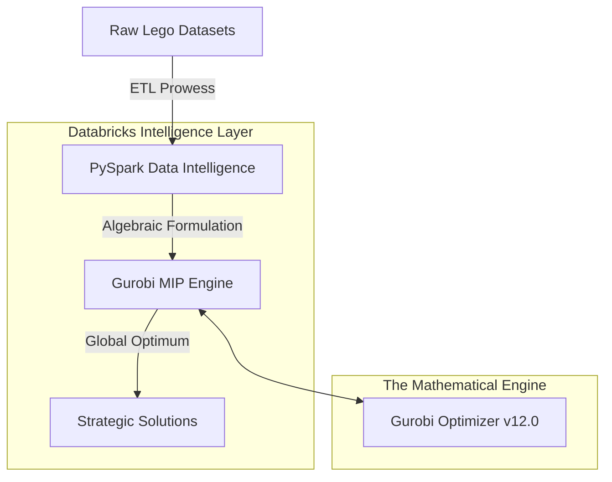

# 🏦 The Harm Monitoring Ecosystem for Digital Safety
## *Architecting Mathematical Prowess with Gurobi & Databricks*

Developed by **Aruni** — A world-class integration of mathematical optimization and scalable data intelligence.

---

## 💎 The Vision: Excellence in Optimization
This project is not merely a collection of scripts; it is a **Masterpiece of Mathematical Logic**. By harnessing the raw power of the **Gurobi Optimizer** atop the **Databricks Data Intelligence Platform**, we have constructed a framework capable of resolving the most intricate product assortment challenges.

What begins as a seemingly simple toy brick assembly problem is, in reality, a sophisticated demonstration of **Mixed-Integer Programming (MIP)**. We translate physical constraints into high-dimensional linear equations, seeking the global optimum where others find only "trial and error."

## 🧠 The Mathematical Core
At the heart of this project lies a rigorous objective function:
- **Maximization of Value**: We don't just "build sets"; we maximize utility across thousands of discrete parts.
- **Dynamic Constraint Resolution**: Handling real-world scarcity through iterative perturbation.
- **Scalable Heuristics**: Moving from small-scale intuition to enterprise-scale precision.

## 🏗️ Premium Architecture

## 📜 The Knowledge Path
1.  **🚀 `01_Prepare_Data.ipynb`**: High-fidelity ETL. We transform raw industrial datasets into optimization-ready vectors.
2.  **⚖️ `02_Optimization_Model.ipynb`**: The Intuition. A deep dive into the calculus of choice and the logic of constraints.
3.  **🏢 `03_Optimization_Model_Large.ipynb`**: Enterprise Horizon. Scaling the mathematical prowess to handle global-scale inventories.

## 🛠️ Performance Prerequisites
- **Databricks Runtime**: 15.4 LTS or superior.
- **Optimization Engine**: Gurobi License (Commercial grade recommended for large-scale prowess).
- **Core Library**: `gurobipy==12.0.0`.

## 🤝 Support & Legacy
This project stands as a testament to the intersection of **Advanced Mathematics** and **Cloud Computation**. Developed with precision, it serves as a blueprint for high-stakes decision-making in retail and supply chain ecosystems.

---
*Created by **Aruni** | Powered by Databricks Industry Solutions*
