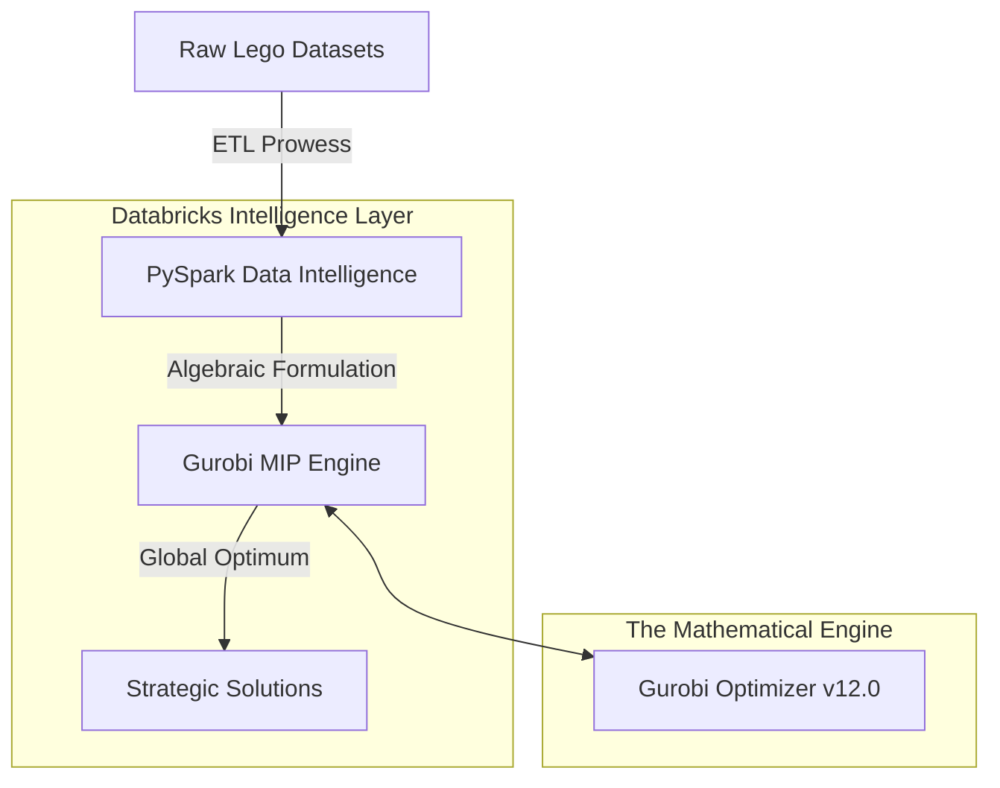

# 🏦 The Harm Monitoring Ecosystem for Digital Safety
## *Architecting Mathematical Prowess with Gurobi & Databricks*

— A world-class integration of mathematical optimization and scalable data intelligence.

---

## The Problem Statement: Complexity vs. Choice
Imagine you have a giant container filled with thousands of loose LEGO bricks of various shapes and colors. You also have access to hundreds of instruction manuals for different LEGO sets. 

**The Challenge:**
Each set requires a specific combination of pieces. You want to build the most valuable collection possible, but you have a limited number of bricks. If you use a rare red brick for "Set A," you can no longer use it for "Set B." Finding the perfect combination to maximize value while respecting your inventory is a massive mathematical puzzle.

**From Toys to Global Industry:**
While we use LEGOs as a case study, this project solves a critical industrial challenge called **Product Assortment Optimization**. 
- **The Bricks** represent a retailer's limited inventory or raw materials.
- **The Sets** represent the finished products a company could choose to sell.
- **The Global Optimum** is the mathematical "sweet spot" that maximizes profit while balancing supply and demand.

By applying **Mixed-Integer Programming (MIP)**, we move beyond human "guesswork" and use the **Gurobi Optimizer** to find the absolute best business decision within seconds.

##  The Mathematical Core
At the heart of this project lies a rigorous objective function:
- **Maximization of Value**: We don't just "build sets"; we maximize utility across thousands of discrete parts.
- **Dynamic Constraint Resolution**: Handling real-world scarcity through iterative perturbation.
- **Scalable Heuristics**: Moving from small-scale intuition to enterprise-scale precision.

## Premium Architecture

##  The Knowledge Path
1.  **`01_Prepare_Data.ipynb`**: High-fidelity ETL. We transform raw industrial datasets into optimization-ready vectors.
2.  **`02_Optimization_Model.ipynb`**: The Intuition. A deep dive into the calculus of choice and the logic of constraints.
3.  **`03_Optimization_Model_Large.ipynb`**: Enterprise Horizon. Scaling the mathematical prowess to handle global-scale inventories.

##  Performance Prerequisites
- **Databricks Runtime**: 15.4 LTS or superior.
- **Optimization Engine**: Gurobi License (Commercial grade recommended for large-scale prowess).
- **Core Library**: `gurobipy==12.0.0`.

##  Support & Legacy
This project stands as a testament to the intersection of **Advanced Mathematics** and **Cloud Computation**. Developed with precision, it serves as a blueprint for high-stakes decision-making in retail and supply chain ecosystems.

---
*Created by **Aruni Saxena** | Powered by Databricks Industry Solutions*
